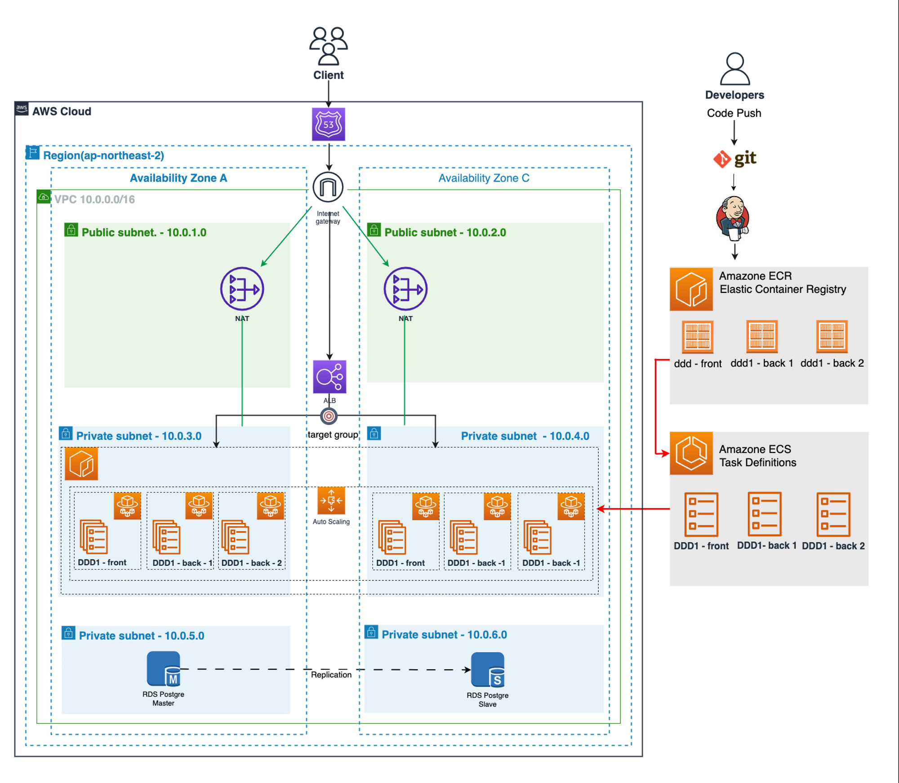

## DevOps 기반의 MVP 프로젝트 운영하기
### 아키텍처

### 아키텍처 설명
-  vpc 와 subnet ip address 값 및 사이더 값은 변경될 수 있습니다.
- route 53 등록 및 도메인 등록은 선택 사항 입니다.
  -  도메인 등록은 aws에서 구매 하실수 있으며 한국에서 구매시 저희는 [가비아](domain.gabia.com) 사이트를 이용했습니다.
  - 도메인을 구매하시게 되면 해당사이트에서 네임서버를 설정하실 수 있습니다.
  - 네임서버에다가 route 53에서 생성한 ns 주소 4개를 하나씩 붙여 넣어주시면 됩니다. (반드시 ns주소 마지막 .은 빼고 넣어주세요)
  - 등록 후 route 53에서 도메인을 생성하고 ip를 맵핑하면 됩니다.
  - 해당 자세한 수업진행은 챕터2 - 백엔드 개발자를 위한 클라우드 인프라 운영 - Amazon 에서 진행 됩니다.
- rds db는 mysql , postqsql에서 본인이 편하신걸로 사용하시면 됩니다. 저희 수업에서는 mysql로 진행 했습니다.

- ECS는 일반 ECS CLUSTER 다루는 방법과 ECS FARGATE 다루는 방식 2가지의 수업으로 진행 합니다.
- 해당 수업에서 진행되는 jenkins server의 서버 구성 셋팅입니다.
  [해당 링크 참조](../chapter-6/final-lab/jenkins_dockerfile)
- 수업에서 필요한 보안자격증명에서 역할과 정책 생성이 필요합니다.
  [해당 링크 참조](../chapter-6/final-lab/iam)
- ECS task definition 샘플 파일 입니다.
  [해당 링크 참조](../chapter-6/final-lab/ecs-task-json)
- jenkins 에서 사용할 pipeline 샘플 코드 입니다.
  [해당 링크 참조](../chapter-6/final-lab/jenkins-pipeline-script)
- mysql 실습 스크립트 입니다.
  [해당 링크 참조](../chapter-6/final-lab/mysql)